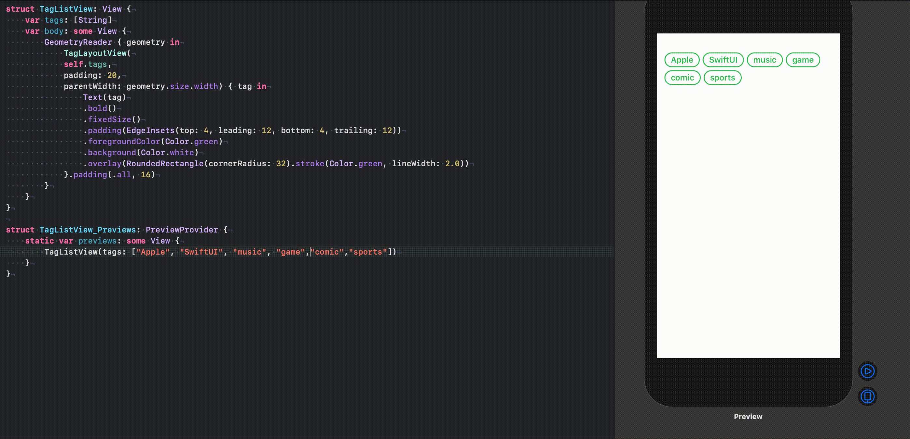

# TagLayoutView
TagLayoutViewTagLayoutView is a library made with SwiftUI for easy tag display.
<p align="center">
    
    
    <a href="https://github.com/yotsu12/TagLayoutView/blob/master/LICENSE"></a>
</p>
<center>

</center>

## Usage
```swift
struct TagListView: View {
    var body: some View {
        GeometryReader { geometry in
            TagLayoutView(
            ["tagA", "tagB", "tagC"],
            padding: 20,
            parentWidth: geometry.size.width) { tag in
                Text(tag)
                .bold()
                .fixedSize()
                .padding(EdgeInsets(top: 4, leading: 12, bottom: 4, trailing: 12))
                .foregroundColor(Color.green)
                .background(Color.white)
                .overlay(RoundedRectangle(cornerRadius: 32).stroke(Color.green, lineWidth: 2.0))
            }.padding(.all, 16)
        }
    }
}
```

## Installation

`TagLayoutView` is available via [Swift Package Manager](https://swift.org/package-manager).

Using Xcode 11, go to `File -> Swift Packages -> Add Package Dependency` and enter [https://github.com/yotsu12/TagLayoutView](https://github.com/yotsu12/TagLayoutView) 